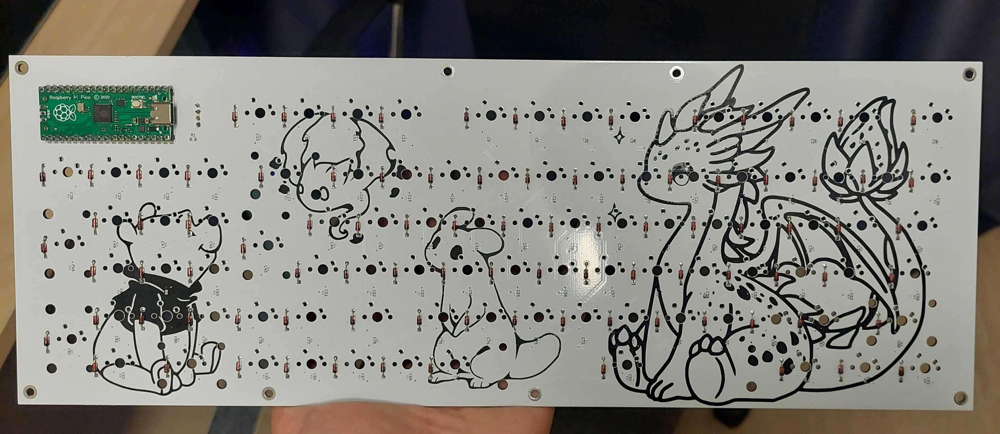

# eliisev2

A fullsize keyboard in QMK using the Raspberry PI PICO devboard (RP2040)

For LEDs the WS2812-2020 are used and 100nF 0402 capacitors for bypass filter.

Diode is DO-35 1N4148

Total of 93 keys but has all functions (second layer TBA)

* Keyboard Maintainer: [Kirito](https://github.com/SantaClawzzz)
* Hardware Supported: [Raspberry PI PICO (RP2040)](https://pip-assets.raspberrypi.com/categories/610-raspberry-pi-pico/documents/RP-008307-DS-1-pico-datasheet.pdf?disposition=inline)
* Hardware Availability: https://www.aliexpress.com/item/1005006087823796.html?spm=a2g0o.order_list.order_list_main.5.1d50a396ZgAemG

### Compile
Make example for this keyboard (after setting up your build environment):

    make eliisev2:default

But if QMK is setup and keyboard folder under keyboards:

    qmk compile -kb eliisev2 -km default

### Flash
Flashing example for this keyboard:

    make eliisev2:default:flash

With QMK setup in QMK MSYS:

    qmk flash -kb eliisev2 -km default

See the [build environment setup](https://docs.qmk.fm/#/getting_started_build_tools) and the [make instructions](https://docs.qmk.fm/#/getting_started_make_guide) for more information. 

Brand new to QMK? Start with our [Complete Newbs Guide](https://docs.qmk.fm/#/newbs).

## Bootloader

Enter the bootloader in 3 ways:

* **Bootmagic reset**: Hold down the key at (0,0) in the matrix (usually the top left key or Escape) and plug in the keyboard
* **Physical reset button**: Hold down the on-board button when plugging the keyboard in
* **Keycode in layout**: Press the key mapped to `QK_BOOT`
